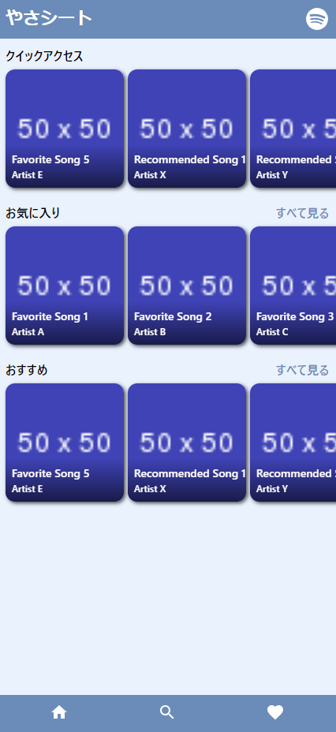
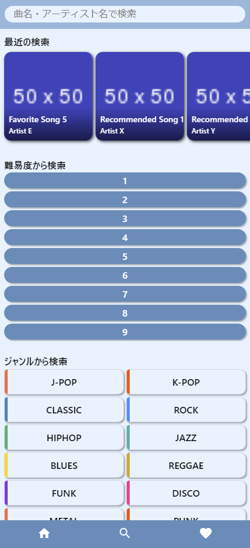

---

marp: true
math: mathjax
paginate: true
style: |
    :root {
        --alert-color: #D33;
    }

    section.cover {
        background: linear-gradient(
            var(--h1-color) 0%,
            var(--h1-color) 52%, /*タイトルの行数と大きさで変える*/
            var(--h1-color) 60%, /*タイトルの行数と大きさで変える*/
            white 0%,
            white 100%
        );
    }

    h1 { /* タイトル */
        color: white;
        font-size: 280%; /*タイトルの文字数で変える*/
    }

    h6 { /*日付など*/
        position: absolute;
        bottom: 25%;
    }

    h4 { /* 所属 */
        position: absolute;
        bottom: 15%;
    }

    h5 { /* 名前 */
        font-size: 120%;
        color: var(--h1-color);
        position: absolute;
        bottom: 10%;
    }

    header {
        font-size: 150%;
        font-weight: 600;
        color: white;
        background: var(--h1-color);
        width: 100%;
        padding: 0.5em 0.8em 0.5em;
        left: 0;
        top: 0;
        line-height: 76%;
    }

    h2 {
        color: white;
        font-size: 300%
    }

    h3 {
        color: var(--h1-color);
    }

    section.content {
        /* 中央寄せじゃなくて上寄せにしたければ外す
        justify-content: start;
        padding-top: 3em;
        */
    }


    blockquote > blockquote > blockquote {
        font-size: 75%;
        font-weight: 400;
        padding: 0;
        margin: 0;
        border: 0;
        border-top: 0.1em dashed #555;
        position: absolute;
        bottom: 40px;
        left: 70px;
        width: 1140px;
    }

    table {
        font-size: 75%;
        margin: 0 auto;
    }

    img[alt~="center"] {
        display: block;
        margin: 0 auto;
    }

    section::after {
        content: attr(data-marpit-pagination) " / " attr(data-marpit-pagination-total);
    }

    /* 2カラムレイアウト */
    .container {
    display: flex;
    }

    .col {
    flex: 1;
    /* padding: 10px; */
    }

    .col ul {
    padding-left: 20px;
    margin-top: 0;
    }

    .col ul li ul {
    margin-bottom: 0.5em;
    }

    /* 画像*/
    .image-gallery-container {
    display: flex!important;
    flex-wrap: wrap;
    justify-content: space-around;
    align-items: flex-start;
    gap: 15px;
    padding: 10px;
    }

    .gallery-image {
    width: 300px;
    height: auto;
    border-radius: 12px;
    object-fit: contain;
    max-height: 520px;
    }

---

<!--
_paginate: false
_class: cover
-->

# 楽器学習ツール<br>「やさシート」

#### 9班

##### 平田、谷口、渡邊、出原、韓


---

<!--
_header: 解決したい課題 - Challenge to Solve
_class: content
-->

### 楽器の練習シーンでの問題に着目

### Focusing on problems in musical instrument practice scenes.

- **課題**: 自身の弾きたい楽曲と自分のレベルに合った楽曲が一致していない
- **Problem**: The songs users want to play often do not match their skill level.
- **提案価値**: ユーザーが弾きたい曲を選び，アプリ側で本人の実力にあった難易度に改変した楽譜を表示する
- **Solution**: Users select songs they want to play, then the app then adjusts the difficulty of the sheet music to match their skill level.

---

<!--
_header: ユーザージャーニー - User Journey
_class: content
-->

1. **楽曲を探す** - Finding music
   - Spotifyの履歴から曲を提案 - Recommendations based on Spotify history
   - 好きな曲を探す - Search new songs

2. **難易度を確認・調整** - Check & adjust difficulty
   - ユーザーの習熟度に合わせて調整 - Adjustment based on proficiency

3. **練習する** - Practice
   - 録音して自分の演奏を確認 - Record and review your playing
   - 演奏に合わせて楽譜が自動的に進む - Score scrolls automatically with your playing

---

<!--
_header: アプリ概要 - Overview
_class: content
-->

### 好きな曲を適切な難易度で練習できる価値を提供
### Providing the value of practicing favorite songs at an appropriate difficulty

- ユーザーの演奏の様子から習熟度を測定 - Measures users' skill level based on their playing
- リアルタイムで楽譜をユーザーのレベルにあったものへ変更する - Automatically adjust the sheet difficulty to match their skill level in realtime

---

<!--
_header: アプリ画面 - App screen
_class: content
-->

<!--  -->

<div class="image-gallery-container">
  
  
  
  <!--  -->
</div>

---

<!--
_header: システム構成 - System Architecture
_class: content
-->

### フロントエンド - Frontend
- **技術** - **Technology**: React + TypeScript + Vite
- **主要機能** - **Features**: 楽譜表示（Sheet display）、音声録音（Audio recording）、検索インターフェース（Search interface）

### バックエンド - Backend
- **技術** - **Technology**: Go + Gin + GORM + SQLite
- **主要機能** - **Features**: 楽曲データ管理（Music data management）、習熟度分析（Proficiency analysis）、Spotify連携（Spotify integration）

---

<!--
_header: API設計 - API Design
_class: content

| エンドポイント / Endpoint | 説明 / Description |
|--------------------------|-------------------|
| GET /api/v1/musics | 楽曲検索 / Music search |
| GET /api/v1/musics/{id} | 楽曲詳細取得 / Get music details |
| GET /api/v1/recommendations | おすすめ楽曲取得 / Get recommendations |
| POST /api/v1/favorites/{music_id} | お気に入り登録 / Add to favorites |
| POST /api/v1/practices/{music_id}/segments/{measure} | 録音データ送信・習熟度取得 / Send recording & get proficiency |
| POST /api/v1/musics/{id}/difficulty-set | 難易度設定保存 / Save difficulty settings |

---
-->

<!--
_header: データモデル - Data Models
_class: content


### 主要データ構造 - Key data structures

```
Music {
  ID, Title, Artist, Genre, Thumbnail
}

Sheet {
  ID, MusicID, Difficulty, SheetData(MusicXML)
}

User {
  ID, Proficiency, SpotifyToken
}

Recording {
  ID, UserID, MusicID, Measure, AudioFile, Proficiency
}
```

---
-->

<!--
_header: 機能一覧 - Features (1/2)
_class: content
-->

- **楽曲の検索・提案・お気に入り** - Song Search / Recommendations / Favorites
  - タイトル・アーティスト・ジャンル・難易度で検索 - Search by title, artist, genre, difficulty
  - Spotify連携によるパーソナライズ推薦 - Personalized recommendations via Spotify

- **楽譜の表示** - Display scores
  - MusicXMLを使用したインタラクティブな楽譜表示 - Interactive score display using MusicXML

- **楽譜の難易度変更** - Change score difficulty
  - 習熟度に基づく自動調整 - Automatically based on proficiency
  - ユーザーによる手動調整 - Manual by user

---

<!--
_header: 機能一覧 - Features (2/2)
_class: content
-->

- **伴奏に合わせて自動で楽譜を進行** - Auto-scroll sheet with playing
  - テンポ調整機能 - Adjust tempo
  - 現在位置のハイライト - Highlight current position

- **演奏の録音・再生** - Record and playback
  - 小節ごとの録音 - Recording by measure
  - 習熟度の算出 - Proficiency feedback

- **修正した楽譜の保存** - Save modified score
  - ユーザー別の難易度設定保存 - Save difficulty settings per user
  - 次回練習時に読み込み - Load at next practice session

---

<!--
_header: 習熟度の計算方法 - Proficiency Calculation Method
_class: content
-->

音声を一定時間ごとに区切り、各時間の基本周波数を求める
正解の音階と検出した音階を手前からマッチング
accuracy：正解の音階を弾けた割合
difference：曲の難易度 - 今の習熟度
differenceが負の時は、定数 * difference * (1 - accuracy)


---

<!--
_header: 各メンバーの役割概要 - Role Summary
_class: content
-->

| &ensp;&ensp;&ensp;&ensp; | Management | UX design | Requirements Definition | UI design | Backend | Frontend | Other |
| :---: | :---: | :---: | :---: | :---: | :---: | :---: | :---: |
| 平田 | ○ || ○ | ○ | ○ | ○ | Interim presentation |
| 谷口 || ○ |||| ○ | Final presentation |
| 渡邊 || ○ |||| ○ ||
| 出原 ||| ○ || ○ ||Data preparation|
| 韓 ||| ○ || ○ || Interim presentation slide |

---

<!--
_header: フロントエンドの役割分担 - Frontend Role Assignment
_class: content
-->

- **谷口**：
  - 楽譜表示、楽譜変更、Spotify認証、CSS
  - Score display, score modification, Spotify authentication, CSS
- **渡邊**：
  - ページ遷移、検索、録音、伴奏再生、再生位置表示
  - Page transition, search, recording, accompaniment playback, playback position display
- **平田**：
  - モバイルフロント実装
  - Mobile frontend implementation

---

<!--
_header: バックエンドの役割分担 - Backend Role Assignment
_class: content
-->

- **出原**：
  - 楽曲検索、楽曲選択、楽曲表示、楽曲保存の各種API
  - Various APIs for song search, song selection, song display, and song storage
- **韓**：
  - お気に入り楽曲、おすすめ楽曲の各種API
  - Various APIs for favorite and recommended music
- **平田**：
  - 技術検証
  - Technical verification
