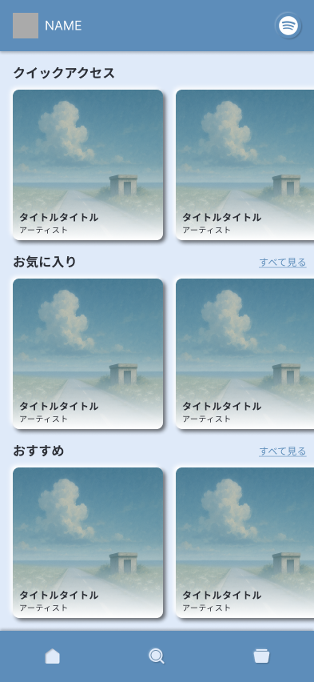
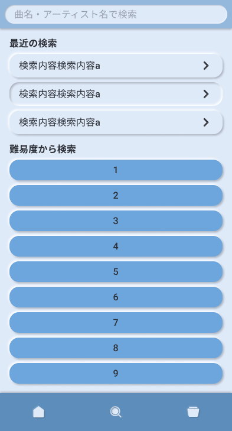
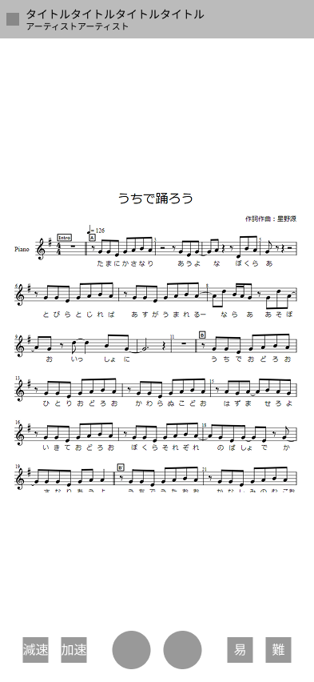

---

marp: true
math: mathjax
paginate: true
style: |
    :root {
        --alert-color: #D33;
    }

    section.cover {
        background: linear-gradient(
            var(--h1-color) 0%,
            var(--h1-color) 52%, /*タイトルの行数と大きさで変える*/
            white 0%,
            white 100%
        );
    }

    h1 { /* タイトル */
        color: white;
        font-size: 280%; /*タイトルの文字数で変える*/
    }

    h6 { /*日付など*/
        position: absolute;
        bottom: 25%;
    }

    h4 { /* 所属 */
        position: absolute;
        bottom: 15%;
    }

    h5 { /* 名前 */
        font-size: 120%;
        color: var(--h1-color);
        position: absolute;
        bottom: 10%;
    }

    header {
        font-size: 180%;
        font-weight: 600;
        color: white;
        background: var(--h1-color);
        width: 100%;
        padding: 0.5em 0.8em 0em;
        left: 0;
        top: 0;
        line-height: 85%;
    }

    h2 {
        color: white;
        font-size: 300%
    }

    h3 {
        color: var(--h1-color);
    }

    section.content {
        /* 中央寄せじゃなくて上寄せにしたければ外す
        justify-content: start;
        padding-top: 3em;
        */
    }
    

    blockquote > blockquote > blockquote {
        font-size: 75%;
        font-weight: 400;
        padding: 0;
        margin: 0;
        border: 0;
        border-top: 0.1em dashed #555;
        position: absolute;
        bottom: 40px;
        left: 70px;
        width: 1140px;
    }

    table {
        font-size: 75%;
        margin: 0 auto;
    }

    img[alt~="center"] {
        display: block;
        margin: 0 auto;
    }

    section::after {
        content: attr(data-marpit-pagination) " / " attr(data-marpit-pagination-total);
    }

    /* 2カラムレイアウト */
    .container {
    display: flex; 
    }

    .col {
    flex: 1;      
    /* padding: 10px; */
    }

    .col ul {
    padding-left: 20px; 
    margin-top: 0;
    }

    .col ul li ul {
    margin-bottom: 0.5em;
    }

    /* 画像*/
    .image-gallery-container {
    display: flex!important;
    flex-wrap: wrap;
    justify-content: space-around;
    align-items: flex-start;
    gap: 15px;
    padding: 10px;
    }

    .gallery-image {
    width: 300px;
    height: auto;
    border-radius: 12px;
    object-fit: contain;
    max-height: 520px;
    }

---

<!--
_paginate: false
_class: cover
-->

# やさシート

#### 9班 中間発表

##### 2025/5/20


---

<!--
_header: 解決したい課題 - Challenge to Solve
_class: content
-->

### 楽器の練習シーンでの問題に着目

### Focusing on problems in musical instrument practice scenes.

- **課題**: 自身の弾きたい楽曲と自分のレベルに合った楽曲が一致していない
- **Problem**: The songs users want to play often do not match their skill level.
- **提案価値**: ユーザーが弾きたい曲を選び，アプリ側で本人の実力にあった難易度に改変した楽譜を表示する
- **Solution**: Users select songs they want to play, then the app then adjusts the difficulty of the sheet music to match their skill level.

---

<!--
_header: ユーザージャーニー - User Journey
_class: content
-->

1. **楽曲を探す** - Finding music
   - 好きな曲を弾きたい → Want to play favorite songs
   - Spotifyの履歴から曲を提案 → Recommendations based on Spotify history
   - 新しい曲を探す → Search new songs

2. **難易度を確認・調整** - Check & adjust difficulty
   - 習熟度に合わせて調整 → Adjustment based on proficiency

3. **練習する** - Practice
   - 録音して自分の演奏を確認 → Record and review your playing
   - 演奏に合わせて楽譜が自動的に進む → Score scrolls automatically with your playing

---

<!--
_header: アプリ概要 - Overview
_class: content
-->

- ユーザーの演奏の様子から熟練度を測定
- The app measures user's skill level based on their playing performance

$$
\downarrow
$$

- リアルタイムで楽譜をユーザーのレベルにあったものへ変更する
- Automatically adjusts the sheet difficulty to match their skill level in realtime.

$$
\downarrow
$$

- 好きな曲を適切な難易度で練習できる喜びを提供
- Provides the joy of practicing favorite songs at an appropriate difficulty level

---

<!--
_header: システム構成 - System Architecture
_class: content
-->

### フロントエンド - Frontend
- **技術**: React + TypeScript + Vite
- **Technology**: React + TypeScript + Vite
- **主要機能**: 楽譜表示、音声録音、検索インターフェース
- **Main Features**: Score display, audio recording, search interface

### バックエンド - Backend
- **技術**: Go + Gin + GORM + SQLite
- **Technology**: Go + Gin + GORM + SQLite
- **主要機能**: 楽曲データ管理、習熟度分析、Spotify連携
- **Main Features**: Music data management, proficiency analysis, Spotify integration

---

<!--
_header: API設計 - API Design
_class: content
-->

| エンドポイント / Endpoint | 説明 / Description |
|--------------------------|-------------------|
| GET /api/v1/musics | 楽曲検索 / Music search |
| GET /api/v1/musics/{id} | 楽曲詳細取得 / Get music details |
| GET /api/v1/recommendations | おすすめ楽曲取得 / Get recommendations |
| POST /api/v1/favorites/{music_id} | お気に入り登録 / Add to favorites |
| POST /api/v1/practices/{music_id}/segments/{measure} | 録音データ送信・習熟度取得 / Send recording & get proficiency |
| POST /api/v1/musics/{id}/difficulty-set | 難易度設定保存 / Save difficulty settings |

---

<!--
_header: データモデル - Data Models
_class: content
-->

### 主要データ構造 - Key data structures

```
Music {
  ID, Title, Artist, Genre, Thumbnail
}

Sheet {
  ID, MusicID, Difficulty, SheetData(MusicXML)
}

User {
  ID, Proficiency, SpotifyToken
}

Recording {
  ID, UserID, MusicID, Measure, AudioFile, Proficiency
}
```

---

<!--
_header: モック - Mock-ups
_class: content
-->

<div class="image-gallery-container">
  
  
  
</div>

---

<!--
_header: 機能一覧 - Features
_class: content
-->

- **楽曲の検索・提案・お気に入り** - Song Search / Recommendations / Favorites
  - タイトル・アーティスト・ジャンルで検索 - Search by title, artist, genre
  - Spotify連携によるパーソナライズ推薦 - Personalized recommendations via Spotify

- **楽譜の表示** - Display scores
  - MusicXMLを使用したインタラクティブな楽譜表示 - Interactive score display using MusicXML
  
- **楽譜の難易度変更** - Change score difficulty
  - 自動調整: 習熟度に基づく - Automatic: Based on proficiency
  - 手動調整: ユーザー選択 - Manual: User selection

---

<!--
_header: 機能一覧（続き）- Features (continued)
_class: content
-->

- **演奏に合わせて自動で楽譜の進行** - Auto-scrolling score with playing
  - テンポ調整機能 - Tempo adjustment feature
  - 現在位置のハイライト - Current position highlighting

- **演奏の録音・再生** - Record and playback
  - 小節ごとの録音 - Recording by measure
  - 習熟度フィードバック - Proficiency feedback

- **修正した楽譜の保存** - Save modified score
  - ユーザー別の難易度設定保存 - Save difficulty settings per user
  - 次回練習時に自動読み込み - Auto-load for next practice session

---

<!--
_header: 現在の進捗 - Current Progress
_class: content
-->

### フロントエンド - Frontend
- 画面遷移とコンポーネント構造の設計完了 - Completed screen transition and component structure design
- 基本UIの実装中 - Basic UI implementation in progress

### バックエンド - Backend
- API設計完了 - API design completed
- データベース設計完了 - Database design completed
- 検索・詳細取得APIの実装中 - Implementing search and detail APIs

---

<!--
_header: 今後の予定 - Future Plans (1/2)
_class: content
-->

### 本周の予定 - This week's plans
- 楽曲検索・表示の基本機能実装 - Implement basic music search and display functionality
  - 検索APIとUIの連携 - Integrate search API with UI
  - 楽曲一覧の表示 - Display music list

- Spotify連携の実装 - Implement Spotify integration
  - 認証フローの構築 - Build authentication flow
  - アカウント連携機能 - Account linking function

---

<!--
_header: 今後の予定 - Future Plans (2/2)
_class: content
-->

### 来週の予定 - Next week's plans
- 楽譜表示エンジンの選定と実装 - Select and implement sheet music display engine
  - MusicXML解析の実装 - Implementation of MusicXML parsing
  - インタラクティブ表示機能 - Interactive display functionality

- 録音機能の基本実装 - Basic implementation of recording function
  - 音声データ送信機能 - Audio data transmission function
  - 小節ごとの録音UI - Recording UI for each measure

- 基本的な難易度調整機能の実装 - Implement basic difficulty adjustment function
  - 難易度変更UIの実装 - Implement UI for difficulty changes

---

<!--
_header: 各メンバーの役割 - Roles of Members
_class: content
-->

<div class="container">
  <div class="col">
    <ul>
      <li>平田
        <ul>
          <li>マネジメント Management</li>
          <li>UIデザイン UI Design</li>
          <li>要件定義 Requirement Definition</li>
        </ul>
      </li>
      <li>出原
        <ul>
          <li>バックエンド Backend development</li>
          <li>要件定義 Requirement Definition</li>
        </ul>
      </li>
      <li>渡邊
        <ul>
          <li>UXデザイン UX Design</li>
          <li>フロントエンド Frontend Development</li>
        </ul>
      </li>
    </ul>
  </div>
  <div class="col">
    <ul>
      <br><br>
      <li>谷口
        <ul>
          <li>UXデザイン UX Design</li>
          <li>フロントエンド Frontend Development</li>
        </ul>
      </li>
      <br>
      <li>韓
        <ul>
          <li>バックエンド Backend Development</li>
        </ul>
      </li>
    </ul>
  </div>
</div>

---

<!--
_header: まとめ - Conclusion
_class: content
-->

### 「やさシート」で実現すること - What "やさシート" achieves

- 好きな曲を自分のレベルで練習できる - Practice favorite songs at your own level
- 習熟度に合わせた適切な難易度提供 - Provide appropriate difficulty based on proficiency
- 効果的な練習体験の実現 - Realize effective practice experience

### 今後の展望 - Future prospects

- ユーザーフィードバックに基づく改善 - Improvement based on user feedback
- 対応楽器の拡大 - Expansion of supported instruments
- コミュニティ機能の検討 - Consideration of community features

